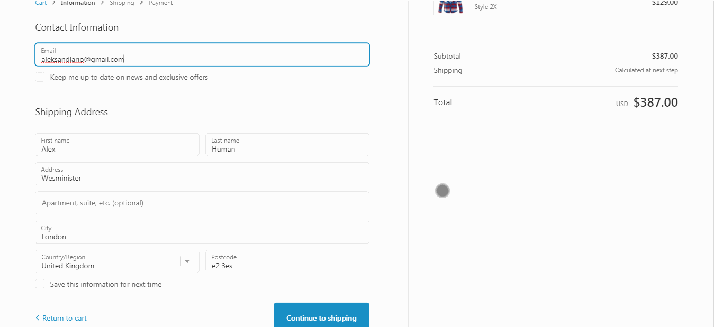

## React remake of a Shopify theme (Palo Alto). 
Kept it close to the original, so most of the stylistic decisions are not mine (like front page image carousel for exmaple). You can check it live at https://palo-alto-redux.vercel.app/

Stack: React, NextJs, Contentful, MongoDb, Mongoose, Styled Components, Stripe, some SendGrid. 

Checkout and payment flow is fully functional albeit with a test key. Some design decisions are suboptimal; I was trying to fit the project into Vercel 12 function limit per hobby project therefore I didn't server render product pages. It might have sped up the site at a cost of some SEO(have to be tested). And backend functions are pretty bulky for the same reason.

## Product page

## Mobile view

## Checkout

## Search

## Filtering

## Blog with comments

